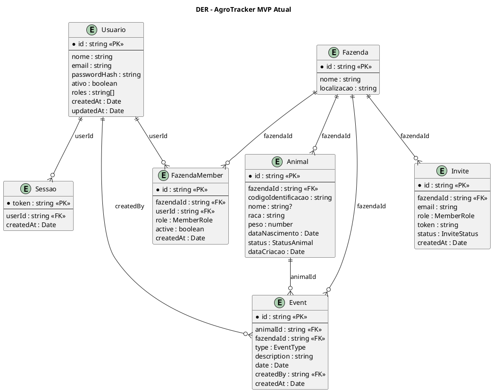
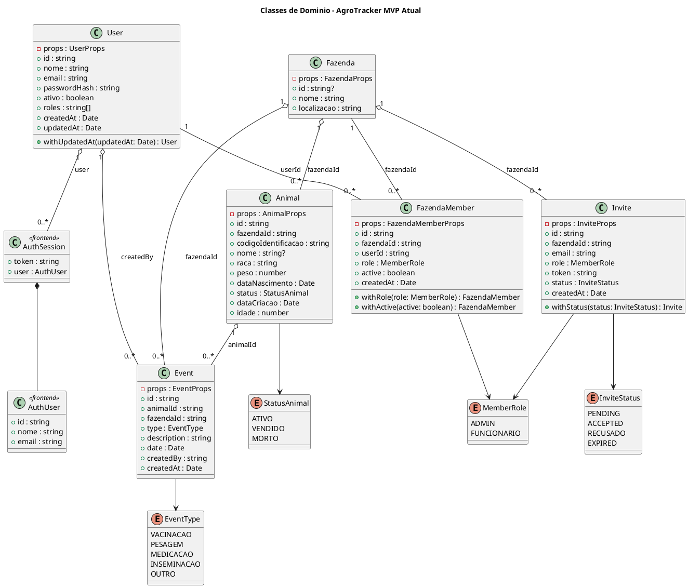
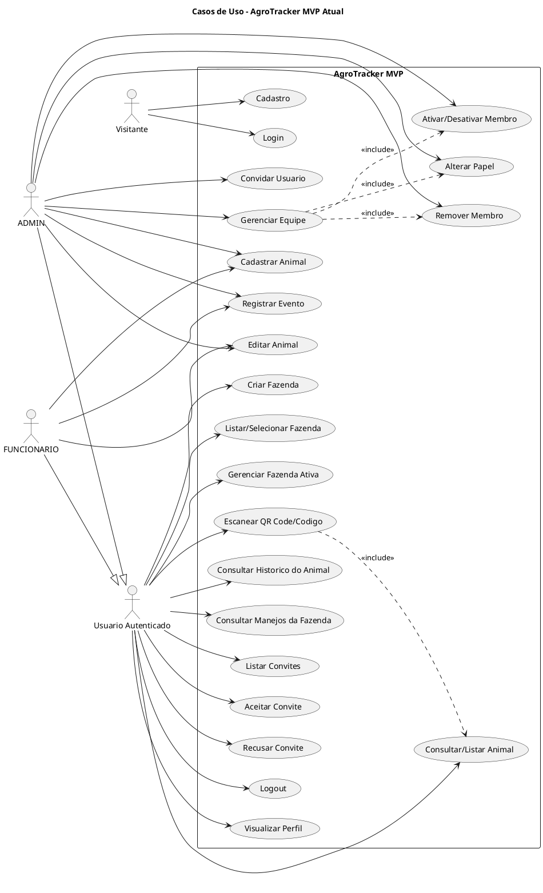

# Arquitetura Atual Consolidada do AgroTracker MVP

Relatorio derivado exclusivamente da implementacao atual em `backend/src`, `frontend/src`, `frontend/app` e dos arquivos JSON em `backend/data`. Documentos antigos foram usados apenas na secao de diferencas, como referencia historica, e nao como fonte para os diagramas.

Homologacao informada: 52 cenarios manuais aprovados e suite automatizada aprovada.

## 1. Mapeamento completo

### Backend

Aplicacao Node.js, Express e TypeScript. Rotas montadas em `backend/src/app.ts`:

| Prefixo | Modulo | Arquivo de rota |
|---|---|---|
| `/auth` | Auth | `backend/src/modules/auth/presentation/routes/authRoutes.ts` |
| `/fazendas` | Fazenda | `backend/src/modules/fazenda/infra/routes/fazenda.routes.ts` |
| `/animals` | Animal | `backend/src/modules/animal/infra/routes/animal.routes.ts` |
| `/events` | Event | `backend/src/modules/event/presentation/eventRoutes.ts` |
| `/` | Membership/Invites | `backend/src/modules/membership/presentation/routes/membershipRoutes.ts` |

Modulos efetivamente implementados em `backend/src/modules`:

| Modulo | Domain | Application/use cases | Infrastructure | Presentation |
|---|---|---|---|---|
| `auth` | `User`, repositorios `IUserRepository`, `ISessionRepository` | `RegisterUser`, `LoginUser`, `GetCurrentUser`, `LogoutUser` | `LocalUserRepository`, `LocalSessionRepository`, `BcryptPasswordHasher`, `MockTokenService` | `AuthController`, `authRoutes`, `ensureAuthenticated` |
| `fazenda` | `Fazenda`, `IFazendaRepository`, use cases no proprio domain | `CreateFazenda`, `GetFazendas`, `UpdateFazenda` | `FazendaRepository`, `FazendaController`, `fazenda.routes` | Nao ha pasta `presentation`; infra contem controller e rotas |
| `animal` | `Animal`, `IAnimalRepository`, use cases no proprio domain | `CreateAnimal`, `GetAnimals`, `UpdateAnimal` | `AnimalRepository`, `AnimalController`, `animal.routes` | Nao ha pasta `presentation`; infra contem controller e rotas |
| `event` | `Event`, `EventType`, `IEventRepository` | `CreateEvent`, `GetEventsByAnimal`, `GetEventsByFazenda` | `LocalEventRepository` | `EventController`, `eventRoutes` |
| `membership` | `FazendaMember`, `Invite`, `MemberRole`, `InviteStatus` | `AddMemberToFazenda`, `InviteUserToFazenda`, `AcceptInvite`, `RejectInvite`, `GetMembersByFazenda`, `GetPendingInvites`, `ChangeMemberRole`, `ToggleMemberActive`, `RemoveMember` | `LocalFazendaMemberRepository`, `LocalInviteRepository` | `MembershipController`, `membershipRoutes`, middlewares de membro/papel |

Persistencia atual:

| Arquivo | Entidade persistida |
|---|---|
| `backend/data/users.json` | Usuario |
| `backend/data/sessions.json` | Sessao |
| `backend/data/fazendas.json` | Fazenda |
| `backend/data/animals.json` | Animal |
| `backend/data/events.json` | Event |
| `backend/data/memberships.json` | FazendaMember |
| `backend/data/invites.json` | Invite |

### Frontend

Aplicacao React Native/Expo Router. Rotas efetivas em `frontend/app` e constantes em `frontend/src/core/routes/AppRoutes.ts`.

| Rota | Tela |
|---|---|
| `/` | `HomeScreen` |
| `/auth` | `LoginScreen` |
| `/auth/register` | `RegisterScreen` |
| `/profile` | `ProfileScreen` |
| `/fazendas` | `FazendaListScreen` |
| `/fazendas/create` | `CreateFazendaScreen` |
| `/fazenda/team` | `TeamManagementScreen` |
| `/fazenda/team/invite` | `InviteUserScreen` |
| `/invites` | `InvitesScreen` |
| `/inventario` | `InventarioScreen` |
| `/manejos` | `ManejosScreen` |
| `/scanner` | `ScannerScreen` |
| `/animal` | `AnimalListScreen` |
| `/animal/create` | `CreateAnimalScreen` |
| `/animal/[id]` | `AnimalDetailScreen` |
| `/animal/[id]/edit` | `EditAnimalScreen` |
| `/animal/[id]/event/create` | `CreateEventScreen` |

Camadas efetivas:

| Camada | Conteudo implementado |
|---|---|
| `domain/entities` | `Animal`, `AuthUser`, `AuthSession` |
| `domain/fazenda` | `Fazenda`, DTOs, `IFazendaRepository`, `CreateFazenda`, `GetFazendas` |
| `domain/events` | `Event`, `EventType`, `IEventRepository`, `CreateEvent`, consultas |
| `domain/membership` | `FazendaMember`, `Invite`, tipos, repositorio e use cases |
| `domain/usecases/auth` | Login, cadastro e usuario atual |
| `domain/usecases/animal` | Criar, atualizar, listar, buscar por id e por codigo |
| `data/api` e `data/events/api` | Contratos HTTP para auth, animal, membership e eventos |
| `data/repositories` | Implementacoes dos repositorios do frontend |
| `presentation/contexts` | `AuthContext`, `ActiveFarmContext` |
| `presentation/viewmodels` | ViewModels para auth, fazenda, animal, scanner, eventos, convites e equipe |
| `presentation/screens` | Telas listadas acima |

## 2. Inventario das entidades

### Usuario (`User`)

Fonte: `backend/src/modules/auth/domain/entities/User.ts`.

| Atributo | Tipo | Obrigatorio | Enum |
|---|---|---|---|
| `id` | `string` | Sim | - |
| `nome` | `string` | Sim | - |
| `email` | `string` | Sim | - |
| `passwordHash` | `string` | Sim | - |
| `ativo` | `boolean` | Sim | - |
| `roles` | `string[]` | Sim | Nao ha enum tipado no `User` |
| `createdAt` | `Date` | Sim | - |
| `updatedAt` | `Date` | Sim | - |

Observacao: no cadastro, `roles` recebe `["FUNCIONARIO"]`.

### Sessao (`Session`)

Fonte: `backend/src/modules/auth/domain/repositories/ISessionRepository.ts`.

| Atributo | Tipo | Obrigatorio | Enum |
|---|---|---|---|
| `token` | `string` | Sim | - |
| `userId` | `string` | Sim | FK para Usuario |
| `createdAt` | `Date` | Sim | - |

### Fazenda

Fonte: `backend/src/modules/fazenda/domain/entities/Fazenda.ts`.

| Atributo | Tipo | Obrigatorio | Enum |
|---|---|---|---|
| `id` | `string | undefined` | Opcional na entidade, preenchido no `CreateFazenda` | - |
| `nome` | `string` | Sim | - |
| `localizacao` | `string` | Sim | - |

### Animal

Fonte: `backend/src/modules/animal/domain/entities/Animal.ts`.

| Atributo | Tipo | Obrigatorio | Enum |
|---|---|---|---|
| `id` | `string` | Sim | - |
| `fazendaId` | `string` | Sim | FK para Fazenda |
| `codigoIdentificacao` | `string` | Sim | - |
| `nome` | `string | undefined` | Opcional | - |
| `raca` | `string` | Sim | - |
| `peso` | `number` | Sim | - |
| `dataNascimento` | `Date` | Sim | - |
| `status` | `StatusAnimal` | Sim | `ATIVO`, `VENDIDO`, `MORTO` |
| `dataCriacao` | `Date` | Sim | - |

Atributo calculado nao persistido: `idade: number`.

### Event

Fonte: `backend/src/modules/event/domain/entities/Event.ts`.

| Atributo | Tipo | Obrigatorio | Enum |
|---|---|---|---|
| `id` | `string` | Sim | - |
| `animalId` | `string` | Sim | FK para Animal |
| `fazendaId` | `string` | Sim | FK para Fazenda |
| `type` | `EventType` | Sim | `VACINACAO`, `PESAGEM`, `MEDICACAO`, `INSEMINACAO`, `OUTRO` |
| `description` | `string` | Sim | - |
| `date` | `Date` | Sim | - |
| `createdBy` | `string` | Sim | FK para Usuario |
| `createdAt` | `Date` | Sim | - |

### FazendaMember

Fonte: `backend/src/modules/membership/domain/entities/FazendaMember.ts`.

| Atributo | Tipo | Obrigatorio | Enum |
|---|---|---|---|
| `id` | `string` | Sim | - |
| `fazendaId` | `string` | Sim | FK para Fazenda |
| `userId` | `string` | Sim | FK para Usuario |
| `role` | `MemberRole` | Sim | `ADMIN`, `FUNCIONARIO` |
| `active` | `boolean` | Sim | - |
| `createdAt` | `Date` | Sim | - |

### Invite

Fonte: `backend/src/modules/membership/domain/entities/Invite.ts`.

| Atributo | Tipo | Obrigatorio | Enum |
|---|---|---|---|
| `id` | `string` | Sim | - |
| `fazendaId` | `string` | Sim | FK para Fazenda |
| `email` | `string` | Sim | - |
| `role` | `MemberRole` | Sim | `ADMIN`, `FUNCIONARIO` |
| `token` | `string` | Sim | - |
| `status` | `InviteStatus` | Sim | `PENDING`, `ACCEPTED`, `RECUSADO`, `EXPIRED` |
| `createdAt` | `Date` | Sim | - |

### Entidades somente de frontend

| Entidade | Atributos | Observacao |
|---|---|---|
| `AuthUser` | `id`, `nome`, `email` | Projecao segura do usuario autenticado |
| `AuthSession` | `token`, `user` | Sessao local persistida em AsyncStorage |
| `FazendaMember` frontend | inclui `nome` e `email` alem dos campos de membership | DTO enriquecido por `GetMembersByFazenda` no backend |
| `Invite` frontend | inclui `fazendaNome?` | DTO enriquecido por `GetPendingInvites` |

## 3. Inventario dos enums/tipos literais

| Nome | Valores | Fonte |
|---|---|---|
| `StatusAnimal` | `ATIVO`, `VENDIDO`, `MORTO` | Backend e frontend `Animal.ts` |
| `EventType` | `VACINACAO`, `PESAGEM`, `MEDICACAO`, `INSEMINACAO`, `OUTRO` | Backend e frontend `events/types.ts` |
| `MemberRole` | `ADMIN`, `FUNCIONARIO` | Backend e frontend `membership/types.ts` |
| `InviteStatus` | `PENDING`, `ACCEPTED`, `RECUSADO`, `EXPIRED` | Backend e frontend `membership/types.ts` |
| `AuthStatus` | `loading`, `authenticated`, `unauthenticated` | Frontend `AuthContext.tsx` |
| `ScannerStatus` | `aguardando`, `consultando`, `encontrado`, `naoEncontrado`, `erro` | Frontend `useScanner.ts` |
| `HttpMethod` | `GET`, `POST`, `PUT`, `PATCH`, `DELETE` | Frontend `ApiClient.ts` |

Observacao: `EventType` possui normalizacao de valores legados no backend (`VACINA`, `VACCINATION`, `WEIGHT`, `MEDICATION`, `REPRODUCTION`), mas estes nao sao valores finais do enum persistido.

## 4. DER final

Relacionamentos implementados:

| Relacionamento | Cardinalidade | Chave |
|---|---|---|
| Usuario 1 ---- N Sessao | Um usuario pode ter varias sessoes | `Session.userId -> User.id` |
| Usuario 1 ---- N FazendaMember | Um usuario pode pertencer a varias fazendas | `FazendaMember.userId -> User.id` |
| Fazenda 1 ---- N FazendaMember | Uma fazenda possui varios membros | `FazendaMember.fazendaId -> Fazenda.id` |
| Fazenda N ---- N Usuario | Implementado por `FazendaMember` | - |
| Fazenda 1 ---- N Animal | Uma fazenda possui varios animais | `Animal.fazendaId -> Fazenda.id` |
| Animal 1 ---- N Event | Um animal possui varios eventos | `Event.animalId -> Animal.id` |
| Fazenda 1 ---- N Event | Uma fazenda possui varios eventos | `Event.fazendaId -> Fazenda.id` |
| Usuario 1 ---- N Event | Um usuario cria varios eventos | `Event.createdBy -> User.id` |
| Fazenda 1 ---- N Invite | Uma fazenda possui varios convites | `Invite.fazendaId -> Fazenda.id` |

Chaves primarias: `User.id`, `Fazenda.id`, `Animal.id`, `Event.id`, `FazendaMember.id`, `Invite.id`, `Session.token`.

## 5. Diagrama de classes final

Classes de dominio implementadas no backend:

| Classe | Responsabilidade |
|---|---|
| `User` | Representa usuario autenticavel |
| `Fazenda` | Representa propriedade/fazenda |
| `Animal` | Representa animal de uma fazenda |
| `Event` | Representa manejo/evento de animal |
| `FazendaMember` | Representa vinculo usuario-fazenda com papel e status |
| `Invite` | Representa convite para entrar em fazenda |

Agregacoes/composicoes observadas no dominio persistido:

| Relacao UML | Implementacao |
|---|---|
| `Fazenda o-- Animal` | Animal referencia `fazendaId`; nao ha delecao em cascata implementada |
| `Animal o-- Event` | Event referencia `animalId`; nao ha delecao em cascata implementada |
| `Fazenda o-- Event` | Event tambem referencia `fazendaId` |
| `Usuario o-- Session` | Session referencia `userId` |
| `Usuario -- FazendaMember -- Fazenda` | Membership implementa associacao N:N |
| `Fazenda o-- Invite` | Invite referencia `fazendaId` |
| `Usuario --> Event` | Event referencia criador via `createdBy` |

Dependencias principais:

| Classe/use case | Depende de |
|---|---|
| `CreateFazenda` | `IFazendaRepository`; rota tambem chama `AddMemberToFazenda` |
| `CreateAnimal` | `IAnimalRepository` |
| `UpdateAnimal` | `IAnimalRepository` |
| `CreateEvent` | `IEventRepository`, `IAnimalRepository`, `IFazendaMemberRepository` |
| `GetEventsByAnimal` | `IEventRepository`, `IAnimalRepository`, `IFazendaMemberRepository` |
| `GetEventsByFazenda` | `IEventRepository`, `IFazendaMemberRepository` |
| `InviteUserToFazenda` | `IFazendaMemberRepository`, `IInviteRepository`, `IUserRepository` |
| `AcceptInvite` | `IInviteRepository`, `IUserRepository`, `AddMemberToFazenda`, `IFazendaMemberRepository` |
| `RejectInvite` | `IInviteRepository`, `IUserRepository` |
| `GetMembersByFazenda` | `IFazendaMemberRepository`, `IUserRepository` |

## 6. Diagrama de casos de uso final

Atores implementados:

| Ator | Evidencia |
|---|---|
| Visitante | Acessa os fluxos publicos de cadastro e login |
| Usuario Autenticado | Middlewares `ensureAuthenticated`, `AuthContext`, rotas protegidas |
| ADMIN | `makeEnsureRole(["ADMIN"])`, telas de equipe/convite |
| FUNCIONARIO | `makeEnsureRole(["ADMIN", "FUNCIONARIO"])` para animais e eventos |

Casos de uso reais:

| Caso de uso | Ator | Evidencia backend | Evidencia frontend |
|---|---|---|---|
| Cadastro | Visitante | `POST /auth/register` | `RegisterScreen`, `useRegisterViewModel` |
| Login | Visitante | `POST /auth/login` | `LoginScreen`, `useLoginViewModel` |
| Visualizar Perfil | Usuario Autenticado | `GET /auth/me` sustenta os dados do usuario autenticado | `ProfileScreen`, `AuthContext.restore` |
| Logout | Usuario Autenticado | `POST /auth/logout` existe no backend | `AuthContext.logout` limpa sessao local; frontend nao chama `/auth/logout` |
| Criar Fazenda | Usuario Autenticado | `POST /fazendas` | `CreateFazendaScreen`, `useCreateFazenda` |
| Listar/selecionar Fazenda | Usuario Autenticado | `GET /fazendas` | `FazendaListScreen`, `ActiveFarmContext` |
| Gerenciar Fazenda Ativa | Usuario Autenticado | Autorizacao por memberships nas rotas | `ActiveFarmContext`, `activeFarmStore` |
| Cadastrar Animal | ADMIN/FUNCIONARIO | `POST /animals` | `CreateAnimalScreen`, `useCreateAnimal` |
| Consultar/Listar Animal | Usuario Autenticado membro ativo | `GET /animals`, `GET /animals/:id`, `GET /animals/by-code` | `AnimalListScreen`, `AnimalDetailScreen`, `useAnimals`, `useAnimalDetail`, `useScanner` |
| Editar Animal | ADMIN/FUNCIONARIO | `PUT /animals/:id` | `EditAnimalScreen`, `useUpdateAnimal` |
| Escanear QR Code/codigo | Usuario Autenticado | Busca por codigo em `GET /animals/by-code` | `ScannerScreen`, `useScanner` |
| Registrar Evento | ADMIN/FUNCIONARIO | `POST /events` | `CreateEventScreen`, `useCreateEvent` |
| Consultar Historico do Animal | Usuario Autenticado membro ativo | `GET /events?animalId=` | `AnimalDetailScreen` |
| Consultar Manejos da Fazenda | Usuario Autenticado membro ativo | `GET /events/fazenda/:id` | `ManejosScreen`, `useManejos` |
| Convidar Usuario | ADMIN | `POST /fazendas/:id/invite` | `InviteUserScreen`, `useInviteUser` |
| Aceitar Convite | Usuario Autenticado | `POST /invites/accept` | `InvitesScreen`, `useInvites` |
| Recusar Convite | Usuario Autenticado | `POST /invites/:id/reject` | `InvitesScreen`, `useInvites` |
| Gerenciar Equipe | ADMIN para mutacoes; membro para consulta | `GET /fazendas/:id/members` | `TeamManagementScreen`, `useTeamManagement`, `useMembers` |
| Alterar Papel | ADMIN | `PATCH /fazendas/:id/members/:memberId/role` | `useMembers.changeRole` |
| Ativar/Desativar Membro | ADMIN | `PATCH /fazendas/:id/members/:memberId/toggle` | `useMembers.toggleActive` |
| Remover Membro | ADMIN | `DELETE /fazendas/:id/members/:memberId` | `useMembers.remove` |

Casos explicitamente nao implementados:

| Caso | Situacao |
|---|---|
| Excluir Animal | Nao ha rota DELETE, use case ou metodo de API frontend para animal |
| Audit/historico de auditoria independente | Existe em documento antigo, mas nao em `backend/src/modules` |

## 7. Matriz de rastreabilidade

Legenda: `Sim` = implementado; `Parcial` = implementado de forma incompleta ou divergente; `Nao` = nao localizado.

| Caso de Uso | Backend | Frontend | Teste automatizado localizado |
|---|---:|---:|---:|
| Cadastro | Sim | Sim | Sim (`useAuth.test.ts`) |
| Login | Sim | Sim | Sim (`useAuth.test.ts`) |
| Visualizar Perfil | Sim | Sim | Sim (`ProfileScreen.test.ts`) |
| Logout | Sim | Parcial | Sim (`ProfileScreen.test.ts`) |
| Criar Fazenda | Sim | Sim | Nao |
| Selecionar Fazenda | Sim | Sim | Sim (`resolveActiveFarmId.test.ts`) |
| Gerenciar Fazenda Ativa | Sim | Sim | Sim (`resolveActiveFarmId.test.ts`, `AutoRefresh.test.ts`) |
| Cadastrar Animal | Sim | Sim | Sim (`CreateAnimal.test.ts`, `AnimalUseCases.test.ts`, `animal.routes.test.ts`) |
| Consultar/Listar Animal | Sim | Sim | Sim (`AnimalRepository.test.ts`, `animal.routes.test.ts`) |
| Editar Animal | Sim | Sim | Sim (`UpdateAnimal.test.ts`, `useUpdateAnimal.test.ts`) |
| Escanear QR Code/codigo | Sim | Sim | Nao localizado |
| Registrar Evento | Sim | Sim | Sim (`CreateEvent.test.ts`, `eventRoutes.test.ts`, `EventController.test.ts`) |
| Consultar Historico do Animal | Sim | Sim | Sim (`EventQueries.test.ts`, `LocalEventRepository.test.ts`) |
| Consultar Manejos da Fazenda | Sim | Sim | Sim (`EventQueries.test.ts`, `eventRoutes.test.ts`) |
| Convidar Usuario | Sim | Sim | Sim (`inviteRoutes.test.ts`, `membershipRoutes.test.ts`) |
| Aceitar Convite | Sim | Sim | Sim (`inviteRoutes.test.ts`, `acceptInviteAndRefreshFarms.test.ts`) |
| Recusar Convite | Sim | Sim | Sim (`inviteRoutes.test.ts`) |
| Gerenciar Equipe | Sim | Sim | Sim (`membershipRoutes.test.ts`) |
| Alterar Papel | Sim | Sim | Sim (`membershipRoutes.test.ts`) |
| Ativar/Desativar Membro | Sim | Sim | Sim (`membershipRoutes.test.ts`) |
| Remover Membro | Sim | Sim | Sim (`membershipRoutes.test.ts`) |

## 8. Diferencas entre implementacao real e escopos antigos

Referencia antiga consultada: `docs/RESUMO_TECNICO_TCC.md`.

### Funcionalidades removidas ou nao encontradas na implementacao atual

| Item em escopo antigo | Implementacao real |
|---|---|
| Modulo `audit` | Nao existe em `backend/src/modules`; aparece apenas em `backend/dist` e no documento antigo |
| Historico/timeline/rastreabilidade de acoes como modulo proprio | Nao ha entidade, rota, repository ou use case de auditoria no codigo fonte atual |
| Exclusao de animal | Documento antigo cita exclusao; codigo atual nao tem `DELETE /animals`, use case ou tela/API para excluir |

### Funcionalidades adicionadas ou presentes na implementacao real

| Item | Evidencia |
|---|---|
| Convites pendentes por email | `GET /invites`, `GetPendingInvites`, `InvitesScreen` |
| Recusa de convite | `POST /invites/:id/reject`, `RejectInvite` |
| Aceite de convite com criacao de membership | `AcceptInvite` + `AddMemberToFazenda` |
| Gerenciamento de equipe completo | Alterar papel, ativar/desativar e remover membro |
| Scanner por codigo | `ScannerScreen`, `useScanner`, `GET /animals/by-code` |
| Eventos/manejos por animal e por fazenda | `GET /events?animalId=`, `GET /events/fazenda/:id` |
| Perfil | `ProfileScreen`, `/profile` |
| Testes automatizados ja existentes | Arquivos `*.test.ts(x)` em backend e frontend |

### Funcionalidades alteradas

| Item | Alteracao real |
|---|---|
| Logout | Backend possui `POST /auth/logout`, mas frontend apenas limpa sessao local e fazenda ativa; nao chama endpoint de logout |
| Fazenda | Criacao de fazenda tambem cria automaticamente membership `ADMIN` para o usuario autenticado |
| Auth roles | `User.roles` existe como `string[]`, mas autorizacao operacional por fazenda usa `FazendaMember.role` |
| Fazenda update | Backend possui `PUT /fazendas/:id`; frontend atual nao expoe API/tela correspondente |

## 9. PlantUML - DER

## 10. PlantUML - Diagrama de classes

## 11. PlantUML - Casos de uso

## 12. Observacoes e duvidas explicitas

1. `backend/dist` contem pastas antigas, incluindo `audit`, mas a fonte atual auditada foi `backend/src`; portanto `audit` nao entrou nos diagramas.
2. `Logout` e completo no backend, mas parcial no frontend porque o app limpa o armazenamento local e nao chama `POST /auth/logout`.
3. `Editar Fazenda` existe no backend, mas nao foi localizada tela ou metodo correspondente em `frontend/src/data/fazenda/api/fazendaApi.ts`.
4. `Fazenda.id` e opcional na classe, mas na persistencia e nas rotas e tratado como chave primaria gerada.
5. Os arquivos JSON nao aplicam FKs no nivel de banco; as chaves estrangeiras listadas no DER sao referencias logicas validadas pela aplicacao.
